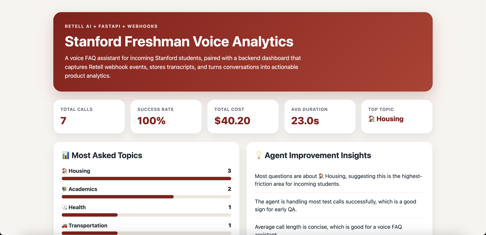
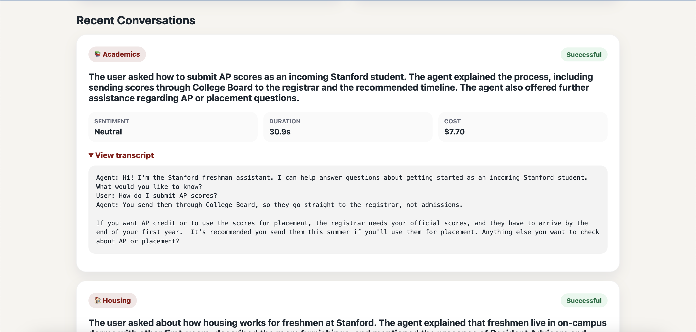
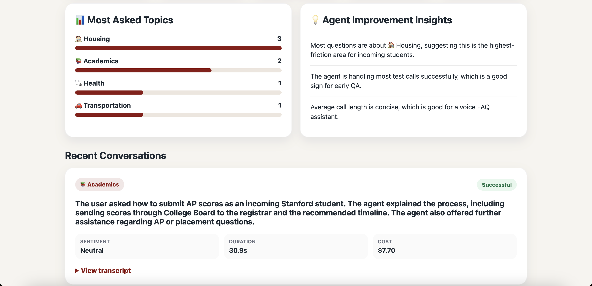

# 🚦 Project Signal

> An AI-powered analytics platform for voice agents.

> Built with FastAPI, PostgreSQL, Retell AI, and Render.

🌐 **Live Demo:** https://project-signal.onrender.com/dashboard

🎙️ **Demo Voice Agent:** Stanford Freshman FAQ Assistant

**Update:** Project Signal v0.2 now uses PostgreSQL for persistent call analytics.
---

# Overview

Voice AI developers often need to manually inspect conversations to understand how their agents are performing.

This project automatically ingests Retell webhook events, stores conversation data, and surfaces meaningful metrics through a clean FastAPI dashboard.

The included demo uses a Stanford Freshman FAQ assistant, but the analytics platform is designed to work with any Retell-powered voice agent.

---

# Features

- 📞 Receives Retell webhook events
- 📝 Stores transcripts and call metadata
- 📊 Tracks call success rate and conversation metrics
- 💰 Calculates call duration and cost
- 🧠 Automatically categorizes conversations by topic
- 💡 Generates AI-powered product insights
- 🚀 Live analytics dashboard deployed on Render

---

# Architecture

```text
Caller
   │
   ▼
Retell Voice Agent
   │
   ▼
Webhook (/webhook)
   │
   ▼
FastAPI Backend
   │
   ▼
Analytics Dashboard
```

---

# Dashboard

## Analytics Overview



## Conversation Analytics



## Agent Insights



---

# Tech Stack

- Python
- FastAPI
- Uvicorn
- Retell AI
- GitHub
- Render

---

# Running Locally

## Clone the repository

```bash
git clone https://github.com/arjunbhardwajcoderbro/stanford-voice-analytics.git
cd stanford-voice-analytics
```

## Install dependencies

```bash
pip install -r requirements.txt
```

## Start the backend

```bash
uvicorn main:app --reload
```

## Open the dashboard

```
http://localhost:8000/dashboard
```

---

# Deployment

The application is deployed on Render and automatically redeploys whenever new commits are pushed to the `main` branch.

**Live Demo**

https://stanford-voice-analytics.onrender.com/dashboard

---

# Why I Built This

While exploring voice AI, I realized webhook events contain far more value than raw transcripts alone.

I wanted to build a lightweight analytics layer that transforms Retell webhook events into actionable insights for developers—including conversation summaries, topic categorization, call success metrics, duration tracking, cost analysis, and product insights.

The Stanford Freshman FAQ assistant serves as the demonstration use case, while the broader goal is to build tooling that helps developers evaluate and improve voice agents.

---

# Future Work

- Prompt A/B testing
- Historical trend analysis
- Multi-agent dashboards
- Semantic conversation search
- Real-time monitoring
- AI-generated prompt improvement suggestions
- Exportable reports
- Slack & Discord alerts
- Custom evaluation metrics

---

# Repository

GitHub:

https://github.com/arjunbhardwajcoderbro/stanford-voice-analytics

---

# About This Project

This project demonstrates how Retell voice agents can be paired with a lightweight analytics platform that captures webhook events, stores conversation data, and transforms calls into actionable insights for developers.

Although the current implementation showcases a Stanford Freshman FAQ assistant, the underlying architecture is reusable for customer support agents, healthcare assistants, recruiting agents, sales agents, and other production voice AI applications.

---

## Built With

- ❤️ Python
- ⚡ FastAPI
- 🎙️ Retell AI
- ☁️ Render
- 🐙 GitHub

---

*Built in one day to explore how voice AI and developer analytics can work together.*
